# E-Commerce Platform Architecture Diagram

## Frontend Pages & Forms Structure

```mermaid
graph TB
    A[Home Page] --> B[Auth]
    A --> C[Products]
    A --> D[Auctions]
    A --> E[Lottery]
    A --> F[User Dashboard]
    A --> G[Admin Dashboard]
    A --> H[Seller Dashboard]

    B --> B1[Login]
    B --> B2[Register]
    B --> B3[Password Reset]

    C --> C1[Product List]
    C --> C2[Product Detail]
    C --> C3[Shopping Cart]
    C --> C4[Checkout]

    D --> D1[Auction List]
    D --> D2[Auction Detail]
    D --> D3[My Bids]
    D --> D4[Won Auctions]

    E --> E1[Lottery List]
    E --> E2[Lottery Detail]
    E --> E3[My Tickets]
    E --> E4[Winners]

    F --> F1[Profile]
    F --> F2[My Orders]
    F --> F3[My Wallet]
    F --> F4[Notifications]
    F --> F5[Transaction History]

    G --> G1[Admin Users]
    G --> G2[Admin Products]
    G --> G3[Admin Orders]
    G --> G4[Admin Auctions]
    G --> G5[Admin Lottery]
    G --> G6[Admin Roles]
    G --> G7[Admin Payments]

    H --> H1[Seller Products]
    H --> H2[Seller Orders]
    H --> H3[Seller Auctions]
    H --> H4[Seller Analytics]
```

## Pages to Create (Priority Order)

### Phase 1: Shopping Cart & Checkout ⭐ HIGH PRIORITY
1. `/pages/cart/index.vue` - Shopping cart page
2. `/pages/checkout/index.vue` - Checkout page with shipping/billing

### Phase 2: Wallet & Transactions ⭐ HIGH PRIORITY
3. `/pages/wallet/index.vue` - User wallet dashboard
4. `/pages/wallet/transactions.vue` - Transaction history

### Phase 3: Auctions 🔥 CORE FEATURE
5. `/pages/auctions/index.vue` - Auction listing
6. `/pages/auctions/[id].vue` - Auction detail with bidding
7. `/pages/auctions/my-bids.vue` - User's bids
8. `/pages/seller/auctions.vue` - Seller auction management
9. `/pages/admin/auctions/index.vue` - Admin auction management

### Phase 4: Lottery 🎰 CORE FEATURE
10. `/pages/lottery/index.vue` - Lottery draws listing
11. `/pages/lottery/[id].vue` - Lottery detail & buy tickets
12. `/pages/lottery/my-tickets.vue` - User's lottery tickets
13. `/pages/admin/lottery/index.vue` - Admin lottery management

### Phase 5: Notifications 🔔
14. `/pages/notifications/index.vue` - Notification center

### Phase 6: Admin - Roles & Permissions 👑
15. `/pages/admin/roles/index.vue` - Role management
16. `/pages/admin/permissions/index.vue` - Permission management

### Phase 7: Payments & Payouts 💳
17. `/pages/payments/index.vue` - Payment history
18. `/pages/admin/payments/index.vue` - Admin payment management
19. `/pages/seller/payouts.vue` - Seller payout dashboard

## Component Breakdown by Page

### Shopping Cart (`/cart/index.vue`)
- Cart items list with quantity controls
- Remove item button
- Subtotal, tax, total calculation
- Proceed to checkout button
- Empty cart state

### Checkout (`/checkout/index.vue`)
- Shipping information form
- Billing information form
- Order summary
- Payment method selection
- Place order button

### Wallet Dashboard (`/wallet/index.vue`)
- Current balance display
- Add funds form
- Recent transactions list
- Withdraw funds option

### Auction Listing (`/auctions/index.vue`)
- Filter: status, category, price range
- Auction cards with countdown timer
- Current bid display
- Quick bid button

### Auction Detail (`/auctions/[id].vue`)
- Product details
- Current bid & bid history
- Bid form with amount input
- Auto-bid setup
- Buy now button (if available)
- Countdown timer
- Winner announcement (if ended)

### Lottery Listing (`/lottery/index.vue`)
- Active lottery draws
- Draw date & time
- Prize pool display
- Tickets remaining
- Buy tickets button

### Lottery Detail (`/lottery/[id].vue`)
- Lottery information
- Ticket price & prize pool
- Buy tickets form (select quantity)
- Your tickets display
- Winners list (if completed)

### Notification Center (`/notifications/index.vue`)
- Notification list (read/unread)
- Mark as read button
- Delete notification
- Filter by type

### Admin Roles (`/admin/roles/index.vue`)
- Role list with permissions count
- Create/Edit role modal
- Assign permissions to role
- Delete role

### Admin Payments (`/admin/payments/index.vue`)
- Payment transaction list
- Filter by status, user, date
- Payment details modal
- Refund option
